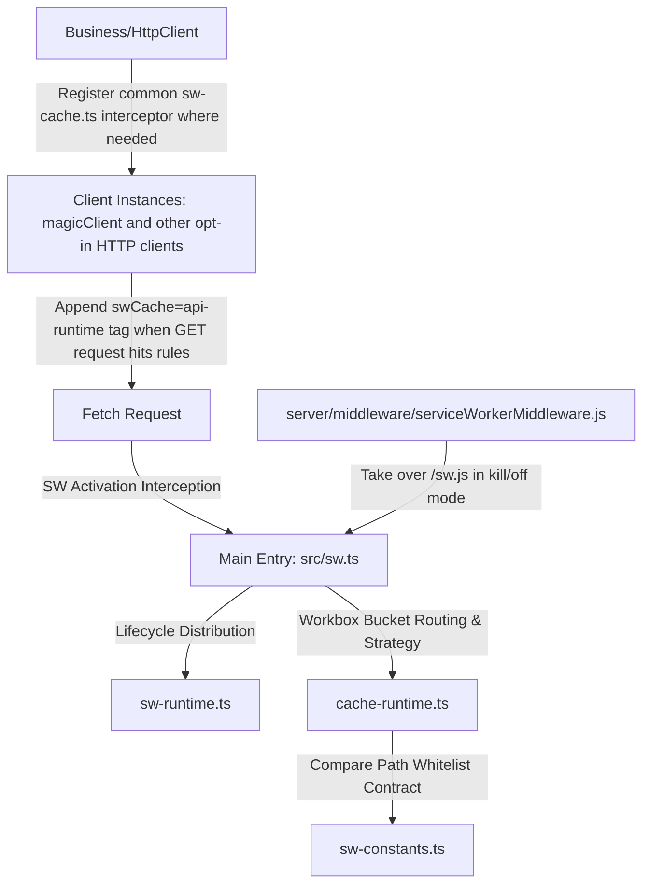

# Service Worker Best Practices

## Scope and Activation Keywords
Use this specification as a priority when the Agent or developer needs to handle the following tasks:
- Adjusting or designing Service Worker cache routing, TTL, cache capacity, and partitioning rules.
- Adjusting page-level Service Worker registration, auto-activation, and force-update reload logic.
- Configuring, optimizing, or troubleshooting critical first-screen API caching (Stale-While-Revalidate).
- Handling online Service Worker self-healing failures, rollbacks, and emergency clearing of specific cache buckets.

Typical activation keywords: "modify cache rules", "add API cache", "SW troubleshooting", "PWA cache optimization", "clear SW", "MAGIC_SW_MODE", "MAGIC_SW_CLEAR_CACHES".

---

## 1. Core Design Philosophy and Security Gates

When handling Service Worker development for this repository, the following design philosophy and security gates must be strictly followed to prevent cache pollution and accidental interception risks:

### 1.1 Static Resource Partitioning Decision Matrix (Cache-First)
Static resources prioritize the `CacheFirst` strategy. To ensure a balance between performance and stability, resources must be strictly partitioned with the following restrictions:
- **Same-Origin Hash Resources** (JS/CSS): Dynamically collected during the Vite build phase in `generateBundle`, pre-cached during SW installation (`install`) to warm up, and written to the `magic-web-app-static-assets-v1` bucket.
- **Same-Origin Hashed Images**: Uses runtime interception, limits the maximum number of items, and is written to the `magic-web-app-image-assets-v1` bucket.
- **Fixed-Path Resources**: Fixed WASM/WebWorker resources without hashes. When requested by the page, they are tagged with `swCache=runtime` via helper functions and written to the `magic-web-app-marked-resource-assets-v1` bucket.
- **Runtime Cache Exclusions**: `/sw.js`, entry HTML, `config.js`, `mockServiceWorker.js`, and `/sw/canvas-design-media/**` must stay out of the main runtime cache buckets. Current code enforces this by route matching boundaries and, for `kill`/`off`, by server-side takeover of `/sw.js`.

### 1.2 Credential Isolation for Cross-Origin Caching
When performing `CacheFirst` caching and interception on cross-origin CDN resources, `credentials: "omit"` must be explicitly applied during SW match and fetch. This prevents user sensitive Tokens/Cookies from being sent, avoiding cross-origin privilege escalation or identity pollution.

### 1.3 API Caching Strategy and Three-Level Control (SWR & Request-Level Overrides)
To accelerate first-screen rendering, `StaleWhileRevalidate` (SWR) cache is introduced for critical read-only GET interfaces. **Caching APIs with frequent write operations or high data consistency requirements is strictly prohibited**.
During HttpClient calls, developers can use the `swCacheOption` option to determine whether to enable caching:
- **`swCacheOption: "no-cache"` (Highest Priority)**: Forces direct network fetch to obtain the latest data, completely bypassing the SW cache. Suitable for scenarios like pull-to-refresh and fetching configurations after successful form submission.
- **`swCacheOption: "cache"` (High Priority)**: Ignores global switches and path whitelists, forcing the response to be stored in the SW cache. Suitable for customized cold-start acceleration on specific pages.
- **`swCacheOption: "default"` or unspecified (Default)**: Follows "Global Switch + Path Whitelist". As long as the global environment variable `MAGIC_ENABLE_API_CACHE` is not `"false"` and the interface path hits the whitelist validation, caching is enabled.

### 1.3.1 Environment Variable Semantics
- **`MAGIC_SW_MODE`**: The browser-side registration code treats `on` and `kill` as registerable modes. `none`, `off`, empty, or unknown values mean "do not register the normal app SW" and unregister existing app SW registrations on the client.
- **`MAGIC_SW_MODE=kill|off` on the server**: `server/middleware/serviceWorkerMiddleware.js` takes over `/sw.js`. `kill` returns a cleanup SW that deletes caches and unregisters itself; `off` returns a lightweight unregister-only SW.
- **`MAGIC_SW_CLEAR_CACHES`**: Only meaningful when the server is serving `MAGIC_SW_MODE=kill`. It accepts a comma-separated cache bucket list, or `ALL` (case-insensitive) to clear all CacheStorage buckets for the current origin. If omitted in `kill` mode, the middleware falls back to the `off` behavior.
- **`MAGIC_ENABLE_API_CACHE`**: Controls the default behavior of the request interceptor. Any value except `"false"` keeps whitelist-based API caching enabled by default.
- **`MAGIC_MOCK` / `MAGIC_FORCE_ENABLE_SW_IN_DEV`**: In development, the app unregisters the normal SW unless local mock mode is enabled or `MAGIC_FORCE_ENABLE_SW_IN_DEV=true` is set.
- **`MAGIC_CDNHOST` / `MAGIC_PUBLIC_CDN_URL`**: Used to build the Workbox runtime URL and vendor cache host allowlist during SW registration.

### 1.4 Anti-Nesting Misalignment and Self-Cleaning Mechanism
To avoid accidental matching of unrelated interfaces that pass whitelisted APIs as query parameters (e.g., `/api/v1/proxy?url=/api/v1/settings/all`):
- **Purification Before Path Matching**: `isCacheableApiRequest` must first parse the request using `new URL` to extract a clean `pathname` (stripping Query and Hash) before performing the match.
- **Strict Regex Standards**: Regular expression rules defined in the whitelist **must be enforced to start with `^` and end with `$`**, prohibiting loose substring regex.
- **CORS-Friendly Self-Cleaning**: The main thread interceptor guides the SW by adding `?swCache=api-runtime`, while the SW must **automatically remove this query parameter** before initiating the network fetch (`requestWillFetch`). This ensures that the actual request sent to the backend is not polluted and eliminates the impact of CORS preflight on cross-origin requests.

### 1.5 Response Envelope Strict Validation (Prevent Cache Pollution)
When a business error occurs, backend interfaces might still return `HTTP 200` but wrap a custom error JSON (e.g., `{ code: 5000, message: "Error" }`).
- **Validation Principle**: The SW-side cache update plugin must clone the response and read the JSON body. Caching is only allowed when `json.code === 1000` (standard business success code) or `json.code === undefined` (raw configuration data like internationalization translation packages). All other responses must return `null` to reject caching.

---

## 2. Project Physical Architecture Map and "Single Source of Truth"

The Service Worker in this project adopts a clear physical structure of "single main SW entry + multiple sub-module runtime reuse + main thread interceptor tagging". Writing matching logic in multiple places on the business side is strictly prohibited.

### 2.1 Physical File Map



- **[sw-constants.ts](../../src/workers/service-worker/sw-constants.ts)**: **Single Source of Truth**. Defines all 7 official cache bucket names, TTL constants, API cache path matching rules (`CACHEABLE_API_RULES`), and path extraction decision functions (`isCacheableApiRequest`).
- **[sw-cache.ts](../../src/apis/clients/interceptor/sw-cache.ts)**: Main thread common request interceptor.
- **[cache-runtime.ts](../../src/workers/service-worker/cache-runtime.ts)**: SW-side Workbox bucket routing definitions, SWR/CacheFirst strategy registration, and the custom 200 success response filtering plugin (`apiBusinessCacheablePlugin`).
- **[sw-runtime.ts](../../src/workers/service-worker/sw-runtime.ts)**: SW-side lifecycle Feature routing table distribution.
- **[register.ts](../../src/workers/service-worker/register.ts)**: Page-side registration, `MAGIC_SW_MODE` gating, SKIP_WAITING activation, and reloading control.
- **[serviceWorkerMiddleware.js](../../server/middleware/serviceWorkerMiddleware.js)**: Server-side `/sw.js` takeover for `kill` and `off` modes, including `MAGIC_SW_CLEAR_CACHES` parsing.
- **[src/sw.ts](../../src/sw.ts)**: Very thin SW entry responsible for bootstrap initialization.

---

## 3. Standard Operating Procedures (Actionable SOP)

When developing or maintaining SW in this repository, you must strictly follow the steps below.

### SOP A: Add Whitelist API Cache
1. Open [sw-constants.ts](../../src/workers/service-worker/sw-constants.ts) and append the path rule to the `CACHEABLE_API_RULES` array. If it is a regular expression, it must start with `^` and end with `$` (e.g., `/^\/api\/v1\/settings\/(all|menu-modules)$/`).
2. Confirm the sender of the API: if it is a newly encapsulated HttpClient or a non-default client, ensure that `swCacheRequestInterceptor` is registered in its constructor or `setupInterceptors`. Do not assume that editing `sw-constants.ts` alone is always sufficient.
3. If the cached API response contains other custom success statuses (or raw responses) besides the success code `1000`, ensure that `cacheWillUpdate` on the SW side (located in `cache-runtime.ts`) contains the normal validation for this property to prevent caching failures due to `json.code !== 1000`.

### SOP B: Modify or Add Static Resource Bucket
1. Define the new `CACHE_NAME` and matching regex in [sw-constants.ts](../../src/workers/service-worker/sw-constants.ts), and add the new bucket name to the `MANAGED_APP_CACHE_NAMES` array (to prevent accidental deletion during the activation cleanup phase).
2. Register the routing rules using `registerRoute` in [cache-runtime.ts](../../src/workers/service-worker/cache-runtime.ts), and configure the capacity and TTL limits of `ExpirationPlugin`.

### SOP C: Automated Verification Flow after Changes
After modifying any SW-related constants, matching rules, or interceptors, **the following verification must be executed before submission**:
1. **Run Unit Tests Trio**:
   ```bash
   pnpm test src/workers/service-worker/__tests__/sw-constants.test.ts
   pnpm test src/workers/service-worker/__tests__/register.test.ts
   pnpm test plugins/__tests__/collect-precache-asset-urls.test.ts
   ```
   Ensure that the path matching rules work correctly and there is no regression in pre-cache list collection during the build.
2. **Execute Production Build Confirmation**:
   ```bash
   pnpm build
   ```
   Verify that the custom Vite plugin can successfully package `src/sw.ts` and generate the `/sw.js` artifact correctly at the project root path.

---

## 4. Emergency Stop-Bleeding and Rollback Plan (Emergency SOP)

If a serious online failure occurs after the Service Worker logic is deployed (such as abnormal login states, white screens, or dirty data reads caused by cache pollution):

1. **First Line of Defense: Global Emergency Deactivation of SW**
   Operations configures the environment variable on the deployment server:
   ```env
   MAGIC_SW_MODE=off
   ```
   This makes the server middleware take over `/sw.js` and return an unregister-only SW. The browser activates that SW and unregisters it without deleting any cache buckets.
2. **Second Line of Defense: Eviction of Specific Cache Buckets**
   If client-side errors persist due to an incorrectly cached API, configure `kill` mode together with explicit cache targets:
   ```env
   MAGIC_SW_MODE=kill
   MAGIC_SW_CLEAR_CACHES=magic-web-app-api-cache-v1
   ```
   The server middleware will return a kill-switch SW for `/sw.js`; when that SW activates in the browser, it deletes only the listed cache buckets and then unregisters itself. Use `MAGIC_SW_CLEAR_CACHES=ALL` only when a full CacheStorage reset is intentional.
3. **Local Development Mock Pitfall Avoidance**
   In development, the normal app SW is not registered unless `MAGIC_MOCK=true` or `MAGIC_FORCE_ENABLE_SW_IN_DEV=true`. If you do enable SW locally and need to avoid stale API reads during debugging, explicitly set `MAGIC_ENABLE_API_CACHE=false` in the local `.env`, or check `Disable cache` in the browser developer tools' Network panel.
