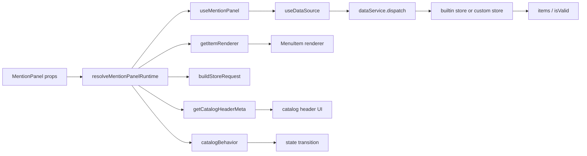

# MentionPanel

`MentionPanel` 是一个面向编辑器和消息输入框的提及面板。

它把「展示 UI」「状态机」「数据来源」「业务域扩展」拆成了几层：

- `index.tsx` / `MentionPanelMobile.tsx` 负责桌面端和移动端 UI
- `hooks/` 负责状态机、搜索、键盘交互、数据加载
- `runtime/` 负责把数据服务、目录跳转、渲染器拼成一套运行时
- `runtime/builtin/` 提供默认的内置实现
- `tiptap-plugin/` 负责把面板接入编辑器的 `@mention` 交互

如果只想快速理解它，记住一句话：

> `MentionPanel` 本身是一个壳，真正决定“展示什么、怎么跳转、怎么校验、怎么渲染”的，是 `runtime`。

## 调用链



## 当前有哪些内容

### 目录分层

```text
MentionPanel/
├── index.tsx
├── MentionPanelMobile.tsx
├── types.ts
├── dispatch.ts
├── builtin-store.ts
├── hooks/
├── renderers/
├── runtime/
│   ├── default-runtime.ts
│   └── builtin/
│       ├── store.ts
│       ├── request-builder.ts
│       ├── renderer.ts
│       ├── catalog-behavior.ts
│       ├── catalog-ids.ts
│       ├── catalog-metadata.ts
│       ├── default-items.ts
│       └── domains/
└── tiptap-plugin/
```

### 当前内置 runtime 包含的业务域

默认首页入口在 `runtime/builtin/default-items.ts` 里，当前包含：

- `project-files`
- `upload-files`
- `agents`
- `mcp-extensions`
- `skills`
- `tools`

当前 builtin catalog 在 `runtime/builtin/registry.ts` 里注册了：

- `upload-files`
- `mcp-extensions`
- `agents`
- `skills`
- `tools`
- `histories`
- `tabs`

当前 builtin search plugin 包含：

- `workspace-files`
- `upload-files`
- `mcp`
- `agents`
- `skills`
- `tools`

当前 builtin validation plugin 包含：

- `project_file`
- `project_directory`
- `upload_file`
- `mcp`
- `agent`
- `skill`
- `tool`
- `design_marker`

当前 builtin renderer 覆盖了：

- `agents`
- `history`
- `mcp`
- `skills`
- `tabs`
- `tools`
- `upload-files`
- `workspace-files`
- 默认通用 renderer

### 组件状态

`MentionPanel` 的核心状态仍然是四种：

- `default`
- `search`
- `directory`
- `catalog`

其中：

- `default` 下输入搜索词，会走“全局搜索”
- `catalog` / `directory` 下输入搜索词，会走“当前列表内过滤”
- 面板的面包屑和回退逻辑由 `navigationStack` 驱动

## runtime 属性包含什么

`MentionPanelProps.runtime` 的类型是 `MentionPanelRuntime<TCatalogId>`，目前包含 5 个可定制部分：

| 字段 | 作用 | 默认实现 |
| --- | --- | --- |
| `dataService` | 真正的数据后端，负责返回列表和校验结果 | `runtime/builtin/store.ts` |
| `catalogBehavior` | 决定选中某项后是“直接选中”还是“跳转到 catalog/folder” | `runtime/builtin/catalog-behavior.ts` |
| `buildStoreRequest` | 把当前状态转换成 `MentionStoreRequest` | `runtime/builtin/request-builder.ts` |
| `getItemRenderer` | 按 `item.type` 返回对应 renderer | `runtime/builtin/renderer.ts` |
| `getCatalogHeaderMeta` | 决定 catalog 顶部 hint 和 icon | `runtime/builtin/catalog-metadata.ts` |

运行时合并优先级如下：

1. `props.runtime.xxx`
2. 旧式顶层 props：`dataService` / `catalogBehavior` / `buildStoreRequest`
3. `defaultMentionPanelRuntime`
4. 空实现兜底

也就是说，推荐的新写法是：

```ts
<MentionPanel
  runtime={{
    dataService: customDataService,
    buildStoreRequest: customBuildStoreRequest,
  }}
/>
```

如果你只想局部替换，也可以只传其中一个字段。

## 场景 1：我想在内置部分新增一种类型

先按第一性原理拆一下，新增一种 builtin 类型，本质上是在补 4 个问题：

1. 这个类型的数据长什么样
2. 它从哪里加载
3. 它怎么参与搜索、校验、跳转
4. 它在 UI 上怎么展示

### 你通常需要补哪些东西

下面以“新增 `prompt` 类型”为例。

| 位置 | 是否常见必需 | 作用 |
| --- | --- | --- |
| `types.ts` | 是 | 增加 `MentionItemType` 和对应 `MentionData` |
| `runtime/builtin/catalog-ids.ts` | 视情况 | 如果它有独立 catalog，要补 catalog id |
| `runtime/builtin/default-items.ts` | 视情况 | 如果它要出现在首页，需要补默认入口 |
| `runtime/builtin/domains/prompt/store.ts` | 是 | 域内数据获取、转换、查询、判定存在性 |
| `runtime/builtin/domains/prompt/catalog.ts` | 常见 | 定义进入该域后返回什么列表 |
| `runtime/builtin/domains/prompt/search.ts` | 常见 | 让全局搜索能搜到它 |
| `runtime/builtin/domains/prompt/validate.ts` | 常见 | 校验历史 mention 是否还有效 |
| `runtime/builtin/domains/prompt/renderer.tsx` | 常见 | 定制图标、后缀、描述 |
| `runtime/builtin/domains/prompt/index.ts` | 是 | 统一导出 |
| `runtime/builtin/registry.ts` | 是 | 把 catalog/search/validate plugin 注册进去 |
| `runtime/builtin/renderer.ts` | 常见 | 把新的 renderer 接入类型映射 |
| `runtime/builtin/store.ts` | 常见 | 构造子 store，并挂到 plugin host 上 |
| `runtime/builtin/registry-types.ts` | 常见 | 扩展 `MentionPanelPluginHost`，暴露新 store 能力 |
| `runtime/builtin/catalog-metadata.ts` | 可选 | 如果该 catalog 顶部需要 hint / icon |

### 每个部分分别代表什么

- `store.ts`
  这个域自己的“数据仓库”，负责把接口数据转成 `MentionItem[]`
- `catalog.ts`
  当面板进入某个 catalog 时，应该展示什么
- `search.ts`
  当默认态做全局搜索时，这个域如何参与搜索
- `validate.ts`
  当已有 mention 被重新检查时，如何确认它仍然有效
- `renderer.tsx`
  决定图标、标题后缀、描述文案
- `registry.ts`
  相当于 builtin runtime 的总装配点
- `catalog-behavior.ts`
  决定“点一下是选中，还是进入下一层”

### 最小扩展示例

如果这个新类型需要出现在首页，并支持全局搜索与校验，最少可以按这个 checklist 走：

1. 在 `types.ts` 增加 `MentionItemType.PROMPT` 和 `PromptMentionData`
2. 新建 `runtime/builtin/domains/prompt/`
3. 在该目录下实现 `store.ts`、`catalog.ts`、`search.ts`、`validate.ts`、`renderer.tsx`、`index.ts`
4. 在 `runtime/builtin/store.ts` 中实例化 `MentionPanelPromptStore`
5. 在 `runtime/builtin/registry-types.ts` 暴露 `promptStore`
6. 在 `runtime/builtin/registry.ts` 注册 catalog/search/validate plugin
7. 在 `runtime/builtin/renderer.ts` 接入 `promptRenderer`
8. 如果首页要展示它，在 `runtime/builtin/default-items.ts` 增加默认入口
9. 如果它有独立 catalog header，在 `runtime/builtin/catalog-metadata.ts` 增加配置

### 一个思考模板

如果你不确定是不是要补全这些文件，可以先问自己 4 个问题：

1. 它能不能从首页进入
2. 它能不能被全局搜索搜到
3. 它插入后的历史 mention 需不需要校验
4. 它需不需要特殊 UI 展示

如果其中某一项答案是否定的，对应的实现就可以不做。

## 场景 2：我想自己实现一个 dataService

这里同样先回到本质。

`dataService` 只做一件事：接收一个 `MentionStoreRequest`，返回这个请求对应的 `MentionStoreResult`。

也就是说，你可以把整个 builtin store 全部替换掉，只保留 `MentionPanel` 的 UI 和交互壳层。

### 需要实现哪些部分

`DataService` 目前有这些能力：

```ts
interface DataService {
  dispatch: (request: MentionStoreRequest) =>
    MentionStoreResult | Promise<MentionStoreResult>
  setRefreshHandler?: (handler: (() => void) | undefined) => void
  preLoadList?: () => void | Promise<void>
  removeFromHistory?: (itemId: string) => void
}
```

其中：

- `dispatch`
  必需。所有数据读取和校验都从这里进
- `setRefreshHandler`
  可选。支持后台增量更新后，静默刷新当前列表
- `preLoadList`
  可选。面板启用时做预加载
- `removeFromHistory`
  可选。支持删除历史记录

### `dispatch` 至少要理解哪些请求

当前请求类型定义在 `dispatch.ts`：

- `default`
- `search`
- `children`
- `catalog`
- `validate`
- `effect`

它们分别表示：

- `default`
  首页默认项
- `search`
  默认态的全局搜索
- `children`
  文件夹子项
- `catalog`
  某个 catalog 的列表
- `validate`
  校验 mention 是否仍有效
- `effect`
  副作用请求，例如刷新 MCP

### 最小可用示例

```ts
import type {
  DataService,
  MentionItem,
  MentionPanelRuntime,
  MentionStoreRequest,
  MentionStoreResult,
} from "./types"

function buildDefaultItems(): MentionItem[] {
  return [
    {
      id: "my-assets",
      type: "project_directory" as const,
      name: "My Assets",
      hasChildren: true,
      isFolder: true,
    },
  ]
}

const customDataService: DataService = {
  dispatch(request: MentionStoreRequest): MentionStoreResult {
    switch (request.kind) {
      case "default":
        return { items: buildDefaultItems() }
      case "search":
        return { items: [] }
      case "children":
        return { items: [] }
      case "catalog":
        return { items: [] }
      case "validate":
        return { isValid: true }
      case "effect":
        return {}
      default:
        return {}
    }
  },
}

const runtime: MentionPanelRuntime = {
  dataService: customDataService,
}
```

接入方式：

```tsx
<MentionPanel runtime={{ dataService: customDataService }} />
```

### 什么时候不只需要 dataService

如果你的自定义数据系统和 builtin 的请求协议不一致，通常还要一起定制：

- `buildStoreRequest`
  当你想改“状态 -> 请求”的映射
- `catalogBehavior`
  当你想改“点某项之后去哪”
- `getItemRenderer`
  当你想为自定义类型提供展示逻辑
- `getCatalogHeaderMeta`
  当你想改 catalog 顶栏提示

最常见的组合是：

```tsx
<MentionPanel
  runtime={{
    dataService: customDataService,
    buildStoreRequest: customBuildStoreRequest,
    catalogBehavior: customCatalogBehavior,
    getItemRenderer: customGetItemRenderer,
  }}
/>
```

### 一个容易忽略的点

`validateMentionWithDataService` 当前要求 `validate` 的返回是同步可得的。

也就是说：

- `dispatch({ kind: "validate" })` 返回普通对象时可以正常参与校验
- 如果它返回 `Promise`，当前工具函数会直接视为无效

因此，如果你要支持 mention 校验，最好让 `validate` 走同步路径，或者同步维护一个本地缓存。

## 场景 3：MentionPanel 的 runtime 属性包含哪些内容

如果把 `runtime` 看成一个“适配层”，它其实分成三类职责：

### 1. 数据职责

- `dataService`
- `buildStoreRequest`

这两项决定“面板怎么拿数据”。

### 2. 交互职责

- `catalogBehavior`

这一项决定“用户点了某一项之后，面板怎么流转状态”。

### 3. 展示职责

- `getItemRenderer`
- `getCatalogHeaderMeta`

这两项决定“拿到 item 之后长什么样”。

### 推荐理解方式

可以把它理解成下面这张表：

| runtime 字段 | 你在替换什么 |
| --- | --- |
| `dataService` | 数据后端 |
| `buildStoreRequest` | 请求协议 |
| `catalogBehavior` | 状态机跳转规则 |
| `getItemRenderer` | item 的视图层 |
| `getCatalogHeaderMeta` | catalog 顶栏视图 |

### 两种常见用法

只替换数据：

```tsx
<MentionPanel runtime={{ dataService: myDataService }} />
```

替换成一整套自定义 runtime：

```tsx
<MentionPanel
  runtime={{
    dataService: myDataService,
    buildStoreRequest: myBuildStoreRequest,
    catalogBehavior: myCatalogBehavior,
    getItemRenderer: myGetItemRenderer,
    getCatalogHeaderMeta: myGetCatalogHeaderMeta,
  }}
/>
```

## 推荐阅读顺序

如果你准备继续改这个组件，建议按下面顺序读：

1. `types.ts`
2. `dispatch.ts`
3. `runtime/default-runtime.ts`
4. `hooks/useMentionPanel.tsx`
5. `hooks/useDataSource.ts`
6. `runtime/builtin/store.ts`
7. `runtime/builtin/registry.ts`
8. `runtime/builtin/registry-types.ts`
9. `runtime/builtin/domains/skills/`
10. `tiptap-plugin/README.md`

`skills` 域是一个比较完整、也比较容易模仿的 builtin 域实现，适合作为扩展示例。

## Sources: 资料来源：

- `src/components/business/MentionPanel/index.tsx` (1-669)
- `src/components/business/MentionPanel/types.ts` (1-560)
- `src/components/business/MentionPanel/dispatch.ts` (1-66)
- `src/components/business/MentionPanel/hooks/useMentionPanel.tsx` (137-899)
- `src/components/business/MentionPanel/hooks/useDataSource.ts` (21-217)
- `src/components/business/MentionPanel/utils/dataService.ts` (1-31)
- `src/components/business/MentionPanel/runtime/default-runtime.ts` (17-97)
- `src/components/business/MentionPanel/runtime/builtin/store.ts` (39-347)
- `src/components/business/MentionPanel/runtime/builtin/request-builder.ts` (7-45)
- `src/components/business/MentionPanel/runtime/builtin/catalog-behavior.ts` (6-67)
- `src/components/business/MentionPanel/runtime/builtin/catalog-ids.ts` (1-37)
- `src/components/business/MentionPanel/runtime/builtin/catalog-metadata.ts` (6-38)
- `src/components/business/MentionPanel/runtime/builtin/default-items.ts` (11-91)
- `src/components/business/MentionPanel/runtime/builtin/renderer.ts` (19-54)
- `src/components/business/MentionPanel/runtime/builtin/registry.ts` (18-58)
- `src/components/business/MentionPanel/runtime/builtin/registry-types.ts` (12-69)
- `src/components/business/MentionPanel/runtime/builtin/domains/skills/catalog.ts` (4-22)
- `src/components/business/MentionPanel/runtime/builtin/domains/skills/search.ts` (3-7)
- `src/components/business/MentionPanel/runtime/builtin/domains/skills/validate.ts` (4-7)
- `src/components/business/MentionPanel/runtime/builtin/domains/skills/store.ts` (7-107)
- `src/components/business/MentionPanel/runtime/builtin/domains/workspace-files/search.ts` (3-12)
- `src/components/business/MentionPanel/runtime/builtin/domains/workspace-files/validate.ts` (8-19)