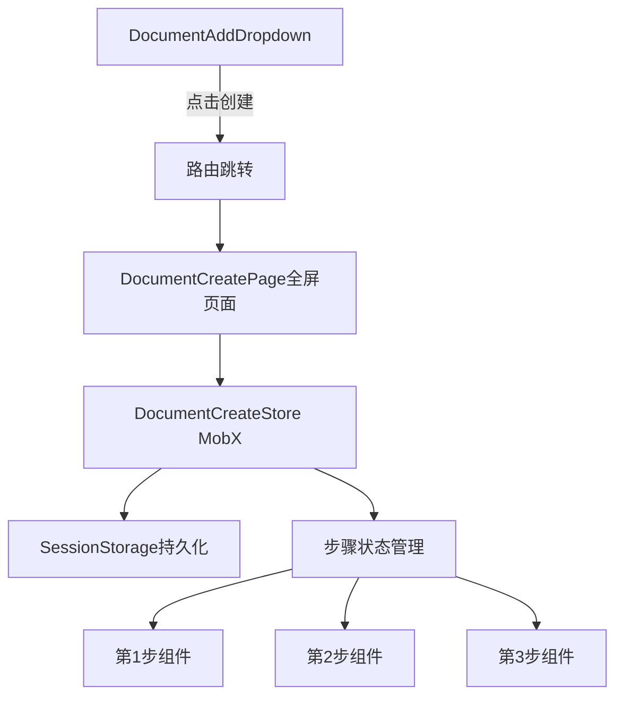
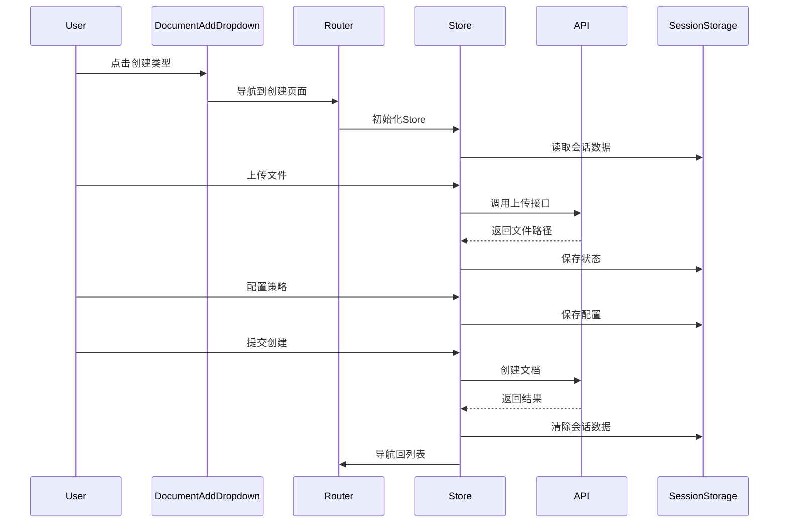

# Crew知识库文档创建功能 - 技术设计方案

## 一、架构设计

### 1.1 路由与状态管理架构



### 1.2 目录结构设计

```
src/pages/superMagic/pages/CrewEdit/pages/DocumentCreate/
├── index.tsx                          # 主路由页面
├── layout.tsx                         # 共享Layout组件
├── constants/
│   ├── index.ts                       # 常量导出
│   ├── document-types.ts              # 文档类型枚举
│   ├── upload-status.ts               # 上传状态枚举
│   └── step-config.ts                 # 步骤配置常量
├── store/
│   ├── index.ts                       # Store导出
│   ├── document-create-store.ts       # 主Store
│   ├── local-document-store.ts        # Local Documents专用
│   ├── custom-content-store.ts        # Custom Content专用
│   ├── project-document-store.ts      # Project专用
│   └── wiki-document-store.ts         # Enterprise Wiki专用
├── components/
│   ├── DocumentCreateHeader.tsx       # 顶部导航栏
│   ├── StepIndicator/                 # 步骤指示器
│   │   ├── index.tsx
│   │   └── types.ts
│   ├── StepNavigation/                # 步骤导航(Previous/Next)
│   │   ├── index.tsx
│   │   └── types.ts
│   ├── FileUploadCard/                # 通用文件上传卡片
│   │   ├── index.tsx
│   │   ├── ProgressBar.tsx
│   │   └── types.ts
│   ├── StrategyConfiguration/         # 策略配置(共享)
│   │   ├── index.tsx
│   │   ├── ChunkingStrategy.tsx
│   │   └── types.ts
│   └── RealTimeUpdates/               # 实时更新显示(共享)
│       ├── index.tsx
│       └── types.ts
├── local-documents/                   # Local Documents页面
│   ├── index.tsx
│   ├── steps/
│   │   ├── UploadFilesStep.tsx       # 第1步
│   │   ├── StrategyConfigStep.tsx    # 第2步
│   │   ├── ChunkPreviewStep.tsx      # 第3步
│   │   └── DataProcessingStep.tsx    # 第4步
│   ├── components/
│   │   ├── FileUploadZone/           # 文件上传区域
│   │   │   ├── index.tsx
│   │   │   ├── UploadButton.tsx
│   │   │   └── UploadedFilesList.tsx
│   │   └── ChunkPreview/             # Chunk预览
│   │       ├── index.tsx
│   │       ├── DocumentList.tsx
│   │       └── HierarchicalView.tsx
│   └── hooks/
│       ├── useFileUpload.ts          # 文件上传逻辑
│       ├── useUploadProgress.ts      # 上传进度管理
│       ├── useFileValidation.ts      # 文件验证
│       └── index.ts
├── custom-content/                    # Custom Content页面
│   ├── index.tsx
│   ├── steps/
│   │   ├── EnterTextStep.tsx         # 第1步
│   │   ├── DataProcessingStep.tsx    # 第2步
│   │   └── ChunkPreviewStep.tsx      # 第3步
│   ├── components/
│   │   └── MarkdownEditor/           # Markdown编辑器
│   │       └── index.tsx
│   └── hooks/
│       └── useMarkdownEditor.ts
├── project-documents/                 # Project页面
│   ├── index.tsx
│   ├── steps/
│   │   ├── SelectProjectStep.tsx     # 第1步
│   │   ├── StrategyConfigStep.tsx    # 第2步
│   │   └── DataProcessingStep.tsx    # 第3步
│   ├── components/
│   │   ├── WorkspaceSelector/
│   │   │   ├── index.tsx
│   │   │   └── SharedWorkspaceDropdown.tsx
│   │   ├── ProjectSelector/
│   │   │   ├── index.tsx
│   │   │   └── ProjectCard.tsx
│   │   └── FileTreeSelector/         # 基于FileSelector封装
│   │       └── index.tsx
│   └── hooks/
│       ├── useWorkspaceSelection.ts
│       ├── useProjectSelection.ts
│       ├── useFileTreeSelection.ts
│       └── index.ts
└── enterprise-wiki/                   # Enterprise Wiki页面
    ├── index.tsx
    ├── steps/
    │   ├── SelectWikiStep.tsx        # 第1步
    │   ├── StrategyConfigStep.tsx    # 第2步
    │   └── DataProcessingStep.tsx    # 第3步
    ├── components/
    │   ├── WikiSelector/
    │   │   └── index.tsx
    │   └── WikiFileTreeSelector/
    │       └── index.tsx
    └── hooks/
        ├── useWikiSelection.ts
        └── index.ts
```

## 二、常量定义

### 2.1 文档类型枚举

```typescript
// constants/document-types.ts
export const DOCUMENT_TYPES = {
  LOCAL: "local",
  CUSTOM: "custom",
  PROJECT: "project",
  WIKI: "wiki",
} as const

export type DocumentType = typeof DOCUMENT_TYPES[keyof typeof DOCUMENT_TYPES]

// 文档类型显示名称映射
export const DOCUMENT_TYPE_LABELS: Record<DocumentType, string> = {
  [DOCUMENT_TYPES.LOCAL]: "Local Documents",
  [DOCUMENT_TYPES.CUSTOM]: "Custom Content",
  [DOCUMENT_TYPES.PROJECT]: "Project",
  [DOCUMENT_TYPES.WIKI]: "Enterprise Wiki",
}
```

### 2.2 上传状态枚举

```typescript
// constants/upload-status.ts
export const UPLOAD_STATUS = {
  UPLOADING: "uploading",
  DONE: "done",
  ERROR: "error",
} as const

export type UploadStatus = typeof UPLOAD_STATUS[keyof typeof UPLOAD_STATUS]

// 状态显示文本映射
export const UPLOAD_STATUS_LABELS: Record<UploadStatus, string> = {
  [UPLOAD_STATUS.UPLOADING]: "上传中",
  [UPLOAD_STATUS.DONE]: "已完成",
  [UPLOAD_STATUS.ERROR]: "上传失败",
}
```

### 2.3 步骤配置常量

```typescript
// constants/step-config.ts
import { DOCUMENT_TYPES, type DocumentType } from "./document-types"

export const STEP_CONFIGS: Record<DocumentType, Array<{number: number, label: string}>> = {
  [DOCUMENT_TYPES.LOCAL]: [
    { number: 1, label: "Upload Files" },
    { number: 2, label: "Strategy Configuration" },
    { number: 3, label: "Chunk Preview" },
    { number: 4, label: "Data Processing" },
  ],
  [DOCUMENT_TYPES.CUSTOM]: [
    { number: 1, label: "Enter Text" },
    { number: 2, label: "Data Processing" },
    { number: 3, label: "Chunk Preview" },
  ],
  [DOCUMENT_TYPES.PROJECT]: [
    { number: 1, label: "Select Project or File" },
    { number: 2, label: "Strategy Configuration" },
    { number: 3, label: "Data Processing" },
  ],
  [DOCUMENT_TYPES.WIKI]: [
    { number: 1, label: "Select Enterprise Wiki" },
    { number: 2, label: "Strategy Configuration" },
    { number: 3, label: "Data Processing" },
  ],
}

// 文件上传限制常量
export const FILE_UPLOAD_LIMITS = {
  MAX_FILE_SIZE: 100 * 1024 * 1024, // 100MB
  MAX_FILE_COUNT: 300,
  SUPPORTED_EXTENSIONS: [
    "txt", "md", "pdf", "xlsx", "xls", 
    "docx", "csv", "xml", "doc", "jpg", "jpeg", "png"
  ],
} as const

// 分块策略常量
export const CHUNKING_STRATEGIES = {
  HIERARCHICAL: "hierarchical",
  FIXED: "fixed",
  SEMANTIC: "semantic",
} as const

export type ChunkingStrategy = typeof CHUNKING_STRATEGIES[keyof typeof CHUNKING_STRATEGIES]
```

### 2.4 常量统一导出

```typescript
// constants/index.ts
export * from "./document-types"
export * from "./upload-status"
export * from "./step-config"
```

## 三、核心Store设计

### 3.1 主Store - DocumentCreateStore

```typescript
// store/document-create-store.ts
import { makeAutoObservable } from "mobx"
import { makePersistable } from "mobx-persist-store"
import { DOCUMENT_TYPES, type DocumentType } from "../constants"

export class DocumentCreateStore {
  // 基础状态
  documentType: DocumentType | null = null
  knowledgeCode: string | null = null
  currentStep = 1
  
  // 子Store实例
  localDocumentStore: LocalDocumentStore
  customContentStore: CustomContentStore
  projectDocumentStore: ProjectDocumentStore
  wikiDocumentStore: WikiDocumentStore
  
  constructor(knowledgeCode: string) {
    this.knowledgeCode = knowledgeCode
    this.localDocumentStore = new LocalDocumentStore()
    this.customContentStore = new CustomContentStore()
    this.projectDocumentStore = new ProjectDocumentStore()
    this.wikiDocumentStore = new WikiDocumentStore()
    
    makeAutoObservable(this, {}, { autoBind: true })
    
    // 持久化配置 - 使用sessionStorage（会话级别，关闭标签页清除）
    makePersistable(this, {
      name: `DocumentCreateStore_${knowledgeCode}`,
      properties: ["documentType", "currentStep"],
      storage: window.sessionStorage,
    })
  }
  
  setDocumentType(type: DocumentType) {
    this.documentType = type
    this.currentStep = 1
  }
  
  nextStep() {
    if (this.canGoNext()) {
      this.currentStep++
    }
  }
  
  previousStep() {
    if (this.currentStep > 1) {
      this.currentStep--
    }
  }
  
  canGoNext(): boolean {
    // 根据当前文档类型和步骤验证
    switch (this.documentType) {
      case DOCUMENT_TYPES.LOCAL:
        return this.localDocumentStore.canGoNext(this.currentStep)
      case DOCUMENT_TYPES.CUSTOM:
        return this.customContentStore.canGoNext(this.currentStep)
      case DOCUMENT_TYPES.PROJECT:
        return this.projectDocumentStore.canGoNext(this.currentStep)
      case DOCUMENT_TYPES.WIKI:
        return this.wikiDocumentStore.canGoNext(this.currentStep)
      default:
        return false
    }
  }
  
  reset() {
    this.documentType = null
    this.currentStep = 1
    // 重置所有子Store
  }
}
```

### 3.2 Local Documents专用Store

```typescript
// store/local-document-store.ts
import { makeAutoObservable } from "mobx"
import { UPLOAD_STATUS, type UploadStatus, CHUNKING_STRATEGIES, type ChunkingStrategy } from "../constants"

export interface UploadFileItem {
  uid: string
  name: string
  file: File
  status: UploadStatus
  progress: number
  path?: string // 上传成功后的路径
  size: number
}

export class LocalDocumentStore {
  // 第1步：文件上传
  uploadedFiles: UploadFileItem[] = []
  
  // 第2步：策略配置
  strategyConfig = {
    chunkingMethod: CHUNKING_STRATEGIES.HIERARCHICAL as ChunkingStrategy,
    chunkSize: 500,
    overlap: 50,
  }
  
  // 第3步：预览数据
  previewData: ContentNode[] = []
  
  // 第4步：处理进度
  processingFiles: Array<{fileId: string, progress: number}> = []
  
  constructor() {
    makeAutoObservable(this, {}, { autoBind: true })
  }
  
  addFiles(files: File[]) {
    // 添加文件到上传队列
  }
  
  removeFile(uid: string) {
    // 移除文件
  }
  
  async uploadFile(item: UploadFileItem) {
    // 上传单个文件，更新进度
  }
  
  canGoNext(step: number): boolean {
    switch (step) {
      case 1:
        return this.uploadedFiles.some(f => f.status === UPLOAD_STATUS.DONE)
      case 2:
        return true // 策略配置有默认值
      case 3:
        return true
      default:
        return false
    }
  }
}
```

## 四、核心复用逻辑

### 4.1 文件上传Hook（复用vectorKnowledge逻辑）

```typescript
// local-documents/hooks/useFileUpload.ts
import { useCallback, useState } from "react"
import { useMemoizedFn } from "ahooks"
import { UPLOAD_STATUS, type UploadStatus } from "../../constants"

interface UploadFileItem {
  uid: string
  name: string
  file: File
  status: UploadStatus
  progress: number
  path?: string
}

export function useFileUpload() {
  const [uploadQueue, setUploadQueue] = useState<UploadFileItem[]>([])
  
  // 复用vectorKnowledge的上传逻辑
  const handleFileUpload = useMemoizedFn(async (file: File, uid?: string) => {
    const newUid = uid || `${file.name}-${Date.now()}`
    
    // 添加到队列
    if (!uid) {
      setUploadQueue(prev => [...prev, {
        uid: newUid,
        name: file.name,
        file,
        status: UPLOAD_STATUS.UPLOADING,
        progress: 0,
      }])
    } else {
      // 重试上传
      setUploadQueue(prev => prev.map(item =>
        item.uid === uid ? { ...item, status: UPLOAD_STATUS.UPLOADING, progress: 0 } : item
      ))
    }
    
    try {
      // 调用上传API（复用现有逻辑）
      const { path } = await uploadFileToPrivateStorage(file, (progress) => {
        setUploadQueue(prev => prev.map(item =>
          item.uid === newUid ? { ...item, progress } : item
        ))
      })
      
      setUploadQueue(prev => prev.map(item =>
        item.uid === newUid ? { ...item, status: UPLOAD_STATUS.DONE, path, progress: 100 } : item
      ))
    } catch (error) {
      setUploadQueue(prev => prev.map(item =>
        item.uid === newUid ? { ...item, status: UPLOAD_STATUS.ERROR } : item
      ))
    }
  })
  
  const removeFile = useMemoizedFn((uid: string) => {
    setUploadQueue(prev => prev.filter(item => item.uid !== uid))
  })
  
  return {
    uploadQueue,
    handleFileUpload,
    removeFile,
  }
}
```

### 4.2 文件验证Hook

```typescript
// local-documents/hooks/useFileValidation.ts
import { useMemoizedFn } from "ahooks"
import { FILE_UPLOAD_LIMITS } from "../../constants"

export function useFileValidation() {
  const validateFile = useMemoizedFn((file: File) => {
    const ext = file.name.split(".").pop()?.toLowerCase()
    
    if (!ext || !FILE_UPLOAD_LIMITS.SUPPORTED_EXTENSIONS.includes(ext)) {
      return { valid: false, error: "不支持的文件格式" }
    }
    
    if (file.size > FILE_UPLOAD_LIMITS.MAX_FILE_SIZE) {
      return { valid: false, error: "文件大小超过100MB" }
    }
    
    return { valid: true }
  })
  
  const validateBatch = useMemoizedFn((files: File[]) => {
    if (files.length > FILE_UPLOAD_LIMITS.MAX_FILE_COUNT) {
      return { valid: false, error: `最多支持${FILE_UPLOAD_LIMITS.MAX_FILE_COUNT}个文件` }
    }
    
    return { valid: true }
  })
  
  return { validateFile, validateBatch }
}
```

## 五、关键组件设计

### 5.1 通用FileUploadCard组件

```tsx
// components/FileUploadCard/index.tsx
import { UPLOAD_STATUS, type UploadStatus } from "../constants"

interface FileUploadCardProps {
  file: {
    name: string
    status: UploadStatus
    progress?: number
    size?: string
  }
  type?: "file" | "project" | "document"
  onDelete?: () => void
  showProgress?: boolean
}

export function FileUploadCard({ 
  file, 
  type = "file",
  onDelete,
  showProgress = true 
}: FileUploadCardProps) {
  return (
    <div className="flex items-center justify-between gap-3 rounded-lg border border-border bg-card p-2">
      <div className="flex items-center gap-3">
        {/* 文件图标 */}
        <div className="size-12 rounded-lg bg-muted flex items-center justify-center">
          <FileIcon extension={getFileExtension(file.name)} />
        </div>
        
        {/* 文件信息 */}
        <div className="flex flex-col gap-1">
          <span className="text-sm font-medium">{file.name}</span>
          <span className="text-xs text-muted-foreground">{file.size}</span>
        </div>
      </div>
      
      {/* 状态/操作 */}
      <div className="flex items-center gap-2">
        {showProgress && file.status === UPLOAD_STATUS.UPLOADING && (
          <Progress value={file.progress} className="w-20" />
        )}
        
        {file.status === UPLOAD_STATUS.DONE && (
          <Check className="size-5 text-green-600" />
        )}
        
        {file.status === UPLOAD_STATUS.ERROR && (
          <AlertCircle className="size-5 text-destructive" />
        )}
        
        {onDelete && (
          <Button variant="ghost" size="icon" onClick={onDelete}>
            <Trash2 className="size-4" />
          </Button>
        )}
      </div>
    </div>
  )
}
```

### 5.2 StepIndicator组件

```tsx
// components/StepIndicator/index.tsx
interface Step {
  number: number
  label: string
  status: "current" | "pending" | "completed"
}

interface StepIndicatorProps {
  steps: Step[]
}

export function StepIndicator({ steps }: StepIndicatorProps) {
  return (
    <div className="flex items-center justify-center gap-20 py-4">
      {steps.map((step, index) => (
        <div key={step.number} className="flex items-center gap-3">
          {/* 步骤圆圈 */}
          <div className={cn(
            "flex size-8 items-center justify-center rounded-full",
            step.status === "current" && "bg-primary text-primary-foreground",
            step.status === "pending" && "border border-border bg-background text-muted-foreground",
            step.status === "completed" && "bg-primary text-primary-foreground"
          )}>
            {step.status === "completed" ? (
              <Check className="size-4" />
            ) : (
              <span className="text-sm font-semibold">{step.number}</span>
            )}
          </div>
          
          {/* 步骤标签 */}
          <span className={cn(
            "text-sm",
            step.status === "current" && "font-medium text-foreground",
            step.status === "pending" && "text-muted-foreground"
          )}>
            {step.label}
          </span>
          
          {/* 连接线 */}
          {index < steps.length - 1 && (
            <div className="w-20 h-0.5 bg-border mx-4" />
          )}
        </div>
      ))}
    </div>
  )
}
```

### 5.3 Project类型的FileTreeSelector

```tsx
// project-documents/components/FileTreeSelector/index.tsx
import { FileSelector } from "@/pages/superMagic/components/Share/FileSelector"

interface FileTreeSelectorProps {
  projectId: string | null
  selectedFiles: string[]
  onSelectionChange: (fileIds: string[], files: any[]) => void
  disabled?: boolean
}

export function FileTreeSelector({
  projectId,
  selectedFiles,
  onSelectionChange,
  disabled
}: FileTreeSelectorProps) {
  // 获取项目文件树数据
  const { data: fileTree } = useProjectFiles(projectId)
  
  return (
    <div className="flex flex-col gap-4 h-full">
      <div className="text-sm font-medium">Select Files</div>
      
      {!projectId ? (
        <div className="flex-1 flex items-center justify-center border border-dashed rounded-lg">
          <div className="text-center text-muted-foreground">
            <FolderOpen className="size-12 mx-auto mb-2" />
            <p>Please select a project first</p>
          </div>
        </div>
      ) : (
        <FileSelector
          attachments={fileTree}
          selectedFileIds={selectedFiles}
          onSelectionChange={onSelectionChange}
          disabled={disabled}
          allowSetDefaultOpen={false}
        />
      )}
    </div>
  )
}
```

## 六、路由配置

```typescript
// routes/crew-edit-routes.ts
export const crewEditRoutes = [
  // ... 现有路由
  {
    path: "/crew/:crewCode/knowledge/:knowledgeCode/document/create",
    element: <DocumentCreatePage />,
    meta: { requireAuth: true }
  },
]
```

## 七、数据流设计



## 八、国际化配置

```typescript
// locales/zh_CN/crew/create.json
{
  "documentCreate": {
    "localDocuments": {
      "title": "本地文档",
      "step1": "上传文件",
      "step2": "策略配置",
      "step3": "Chunk预览",
      "step4": "数据处理"
    },
    "customContent": {
      "title": "自定义内容",
      "step1": "输入文本"
    },
    // ... 其他翻译
  }
}
```

## 九、实现优先级

### Phase 1: 基础架构 (2天)

- 创建目录结构
- 定义所有常量和枚举（constants目录）
- 实现Store基础架构
- 配置路由
- 实现共享Layout和Header

### Phase 2: Local Documents (3天)

- 实现4个步骤组件
- 复用文件上传逻辑
- 实现FileUploadCard组件
- 集成StrategyConfiguration

### Phase 3: Custom Content (1天)

- 实现Markdown编辑器集成
- 实现3个步骤流程

### Phase 4: Project Documents (2天)

- 实现工作区选择
- 实现项目选择
- 封装FileTreeSelector
- 实现共享工作区下拉框

### Phase 5: Enterprise Wiki (1.5天)

- 复用Project逻辑
- 实现Wiki选择器
- 调整文件树交互

### Phase 6: 测试与优化 (0.5天)

- 状态持久化测试
- 刷新行为验证
- 性能优化

## 十、技术要点

1. **组件抽离原则**：单个组件不超过300行，复杂逻辑抽离为hooks
2. **Hooks命名规范**：use + 具体功能名称，如`useFileUpload`
3. **常量枚举规范**：

   - ✅ 所有枚举值定义在`constants/`目录
   - ✅ 使用`as const`断言确保类型安全
   - ✅ 禁止硬编码字符串，必须引用常量
   - ✅ 示例：`status: UPLOAD_STATUS.DONE` 而非 `status: "done"`

4. **样式系统**：100% Tailwind CSS，不使用antd-style
5. **类型安全**：所有Props和State必须定义TypeScript类型
6. **状态持久化**：使用`mobx-persist-store` + `sessionStorage`（会话级别，关闭标签页自动清除）
7. **图标使用**：优先`lucide-react`，统一16px尺寸

## 十一、风险与注意事项

1. **API兼容性**：需确认`/api/v1/super-agent/collaboration-projects`接口可用
2. **文件上传限制**：需处理300个文件、100MB/单文件的边界情况
3. **状态同步**：刷新页面后需正确恢复到当前步骤（sessionStorage会话内有效）
4. **会话生命周期**：关闭标签页后sessionStorage自动清除，重新打开需从头开始
5. **性能考虑**：大文件上传时的内存管理和进度更新频率