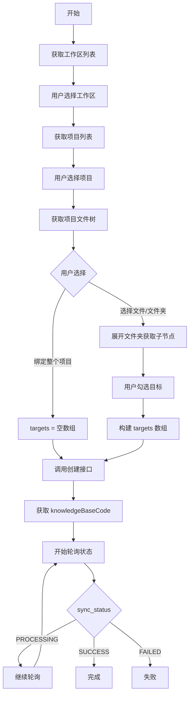
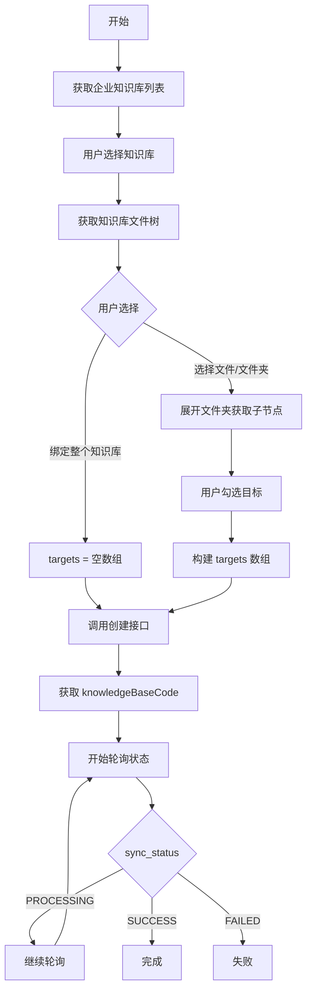

# 项目文件与企业知识库类型创建对接方案

## 一、概述对比

### 1.1 两种类型对比

| 特性 | 项目文件类型 (source_type=3) | 企业知识库类型 (source_type=4) |
|------|----------------------------|-------------------------------|
| **provider** | `"project"` | `"teamshare"` |
| **root_type** | `"project"` | `"knowledge_base"` |
| **数据层级** | 工作区 → 项目 → 文件夹 → 文件 | 企业知识库 → 文件夹 → 文件 |
| **节点类型** | workspace, project, folder, file | knowledge_base, folder, file |
| **使用场景** | 代码仓库、开发项目文档 | 企业共享文档、飞书云文档 |

### 1.2 共同特点

✅ 都需要通过 `source_bindings` 配置数据源  
✅ 都支持实时同步（realtime）和手动同步（manual）  
✅ 都支持绑定整个根节点或选择部分文件/文件夹  
✅ 创建后需要轮询知识库的 `sync_status` 监控物化进度  

---

## 二、后端需要提供的接口

### 2.1 核心接口列表

#### 📋 共用接口

| 接口 | 方法 | 说明 |
|------|------|------|
| 创建知识库 | `POST /api/v1/knowledge-bases` | 带 source_bindings 的创建 |
| 查询知识库详情 | `GET /api/v1/knowledge-bases/{code}` | 获取同步进度 |
| 获取来源节点 | `GET /api/v1/knowledge-bases/source-bindings/nodes` | 获取层级数据 |

#### 📁 项目文件专用查询参数

```bash
# 1. 获取工作区列表
GET /api/v1/knowledge-bases/source-bindings/nodes?source_type=project&parent_type=root&page=1&page_size=20

# 2. 获取项目列表
GET /api/v1/knowledge-bases/source-bindings/nodes?source_type=project&parent_type=workspace&parent_ref={workspaceRef}&page=1&page_size=20

# 3. 获取项目文件树（根目录）
GET /api/v1/knowledge-bases/source-bindings/nodes?source_type=project&parent_type=project&parent_ref={projectRef}

# 4. 获取文件夹子节点
GET /api/v1/knowledge-bases/source-bindings/nodes?source_type=project&parent_type=folder&parent_ref={folderRef}
```

#### 🏢 企业知识库专用查询参数

```bash
# 1. 获取企业知识库列表
GET /api/v1/knowledge-bases/source-bindings/nodes?source_type=enterprise_knowledge_base&provider=teamshare&parent_type=root

# 2. 获取知识库文件树（根目录）
GET /api/v1/knowledge-bases/source-bindings/nodes?source_type=enterprise_knowledge_base&provider=teamshare&parent_type=knowledge_base&parent_ref={knowledgeBaseRef}

# 3. 获取文件夹子节点
GET /api/v1/knowledge-bases/source-bindings/nodes?source_type=enterprise_knowledge_base&provider=teamshare&parent_type=folder&parent_ref={folderRef}
```

---

## 三、接口详细说明

### 3.1 获取来源节点接口

**接口地址：** `GET /api/v1/knowledge-bases/source-bindings/nodes`

**通用查询参数：**

| 参数 | 必填 | 说明 | 示例值 |
|------|------|------|--------|
| source_type | ✅ | 来源类型 | `project` 或 `enterprise_knowledge_base` |
| parent_type | ✅ | 父节点类型 | `root`, `workspace`, `project`, `folder`, `knowledge_base` |
| parent_ref | ❌ | 父节点引用ID | 当 parent_type 不是 root 时必填 |
| provider | ❌ | 提供方 | 企业知识库时填 `teamshare` |
| page | ❌ | 页码 | 默认 1 |
| page_size | ❌ | 每页数量 | 默认 20 |

**响应结构：**

```json
{
  "code": 1000,
  "message": "success",
  "data": {
    "list": [
      {
        "node_type": "workspace|project|folder|file|knowledge_base",
        "node_ref": "唯一引用ID",
        "node_name": "节点名称",
        "selectable": true,
        "has_children": true,
        "metadata": {
          "path": "/路径",
          "size": 1024,
          "extension": "md",
          "description": "描述",
          "created_at": 1734567890
        }
      }
    ],
    "page": 1,
    "page_size": 20,
    "total": 50
  }
}
```

**节点类型说明：**

| node_type | 说明 | selectable | has_children |
|-----------|------|------------|--------------|
| workspace | 工作区 | ❌ | ✅ |
| project | 项目 | ✅ | ✅ |
| knowledge_base | 企业知识库 | ✅ | ✅ |
| folder | 文件夹 | ✅ | ✅ |
| file | 文件 | ✅ | ❌ |

---

### 3.2 创建知识库接口

**接口地址：** `POST /api/v1/knowledge-bases`

#### 场景1: 项目文件类型（绑定整个项目）

```json
{
  "name": "前端项目文档",
  "description": "自动同步前端项目所有文档",
  "enabled": true,
  "source_type": 3,
  "agent_codes": ["SMA-xxx"],
  "fragment_config": {
    "mode": 2
  },
  "source_bindings": [
    {
      "provider": "project",
      "root_type": "project",
      "root_ref": "project-xyz789",
      "sync_mode": "realtime",
      "enabled": true,
      "sync_config": {},
      "targets": []
    }
  ]
}
```

#### 场景2: 项目文件类型（选择部分文件夹）

```json
{
  "name": "项目文档精选",
  "description": "只同步 docs 和 README",
  "enabled": true,
  "source_type": 3,
  "agent_codes": ["SMA-xxx"],
  "fragment_config": {
    "mode": 3,
    "hierarchy": {
      "max_level": 3,
      "keep_hierarchy_info": true,
      "text_preprocess_rule": []
    }
  },
  "source_bindings": [
    {
      "provider": "project",
      "root_type": "project",
      "root_ref": "project-xyz789",
      "sync_mode": "manual",
      "enabled": true,
      "sync_config": {},
      "targets": [
        {
          "target_type": "folder",
          "target_ref": "folder-docs456"
        },
        {
          "target_type": "file",
          "target_ref": "file-readme789"
        }
      ]
    }
  ]
}
```

#### 场景3: 企业知识库类型（绑定整个知识库）

```json
{
  "name": "飞书企业文档",
  "description": "自动同步企业知识库所有文档",
  "enabled": true,
  "source_type": 4,
  "agent_codes": ["SMA-xxx"],
  "fragment_config": {
    "mode": 2
  },
  "source_bindings": [
    {
      "provider": "teamshare",
      "root_type": "knowledge_base",
      "root_ref": "kb-abc123",
      "sync_mode": "realtime",
      "enabled": true,
      "sync_config": {},
      "targets": []
    }
  ]
}
```

#### 场景4: 企业知识库类型（选择部分文件夹）

```json
{
  "name": "产品文档精选",
  "description": "只同步产品规划和需求文档",
  "enabled": true,
  "source_type": 4,
  "fragment_config": {
    "mode": 2
  },
  "source_bindings": [
    {
      "provider": "teamshare",
      "root_type": "knowledge_base",
      "root_ref": "kb-abc123",
      "sync_mode": "realtime",
      "enabled": true,
      "sync_config": {},
      "targets": [
        {
          "target_type": "folder",
          "target_ref": "folder-product-planning"
        },
        {
          "target_type": "folder",
          "target_ref": "folder-requirements"
        }
      ]
    }
  ]
}
```

**响应示例：**

```json
{
  "code": 1000,
  "message": "success",
  "data": {
    "code": "KB-project123",
    "name": "前端项目文档",
    "description": "自动同步前端项目所有文档",
    "enabled": true,
    "source_type": 3,
    "sync_status": 3,
    "expected_count": 50,
    "completed_count": 0,
    "document_count": 0,
    "agent_codes": ["SMA-xxx"],
    "source_bindings": [
      {
        "provider": "project",
        "root_type": "project",
        "root_ref": "project-xyz789",
        "sync_mode": "realtime",
        "enabled": true,
        "sync_config": {},
        "targets": []
      }
    ],
    "created_at": 1734567890,
    "updated_at": 1734567890
  }
}
```

---

### 3.3 轮询知识库同步状态

**接口地址：** `GET /api/v1/knowledge-bases/{code}`

**轮询逻辑：**
- 创建后知识库的 `sync_status` 初始为 3 (PROCESSING)
- 每 3 秒轮询一次
- 根据 `expected_count` 和 `completed_count` 计算进度
- 当 `sync_status` 变为 1 (SUCCESS) 或 2 (FAILED) 时停止

**响应示例：**

```json
{
  "code": 1000,
  "message": "success",
  "data": {
    "code": "KB-project123",
    "name": "前端项目文档",
    "sync_status": 3,
    "sync_status_message": "",
    "expected_count": 50,
    "completed_count": 25,
    "document_count": 25,
    "source_bindings": [
      {
        "provider": "project",
        "root_type": "project",
        "root_ref": "project-xyz789",
        "sync_mode": "realtime",
        "enabled": true,
        "targets": []
      }
    ],
    "updated_at": 1734567895
  }
}
```

---

## 四、完整对接流程

### 4.1 项目文件类型创建流程



### 4.2 企业知识库类型创建流程



---

## 五、前端对接步骤详解

### 5.1 项目文件类型 - 完整代码示例

```javascript
// ========== 步骤1: 获取工作区列表 ==========
async function loadWorkspaces() {
  const response = await fetch(
    '/api/v1/knowledge-bases/source-bindings/nodes?source_type=project&parent_type=root&page=1&page_size=20',
    {
      method: 'GET',
      headers: {
        'authorization': 'Bearer xxx',
        'organization-code': 'DT001',
        'request-id': 'demo-' + Date.now(),
        'x-forwarded-user': ';'
      }
    }
  );
  
  const result = await response.json();
  return result.data.list;
  // 返回: [{ node_type: 'workspace', node_ref: 'ws-123', node_name: '研发工作区', ... }]
}

// ========== 步骤2: 获取项目列表 ==========
async function loadProjects(workspaceRef) {
  const response = await fetch(
    `/api/v1/knowledge-bases/source-bindings/nodes?source_type=project&parent_type=workspace&parent_ref=${workspaceRef}&page=1&page_size=20`,
    {
      method: 'GET',
      headers: { /* 同上 */ }
    }
  );
  
  const result = await response.json();
  return result.data.list;
  // 返回: [{ node_type: 'project', node_ref: 'proj-456', node_name: '前端项目', selectable: true, ... }]
}

// ========== 步骤3: 获取项目文件树 ==========
async function loadProjectTree(projectRef) {
  const response = await fetch(
    `/api/v1/knowledge-bases/source-bindings/nodes?source_type=project&parent_type=project&parent_ref=${projectRef}`,
    {
      method: 'GET',
      headers: { /* 同上 */ }
    }
  );
  
  const result = await response.json();
  return result.data.list;
  // 返回: [
  //   { node_type: 'folder', node_ref: 'folder-docs', node_name: 'docs', selectable: true, has_children: true },
  //   { node_type: 'file', node_ref: 'file-readme', node_name: 'README.md', selectable: true }
  // ]
}

// ========== 步骤4: 展开文件夹（可选） ==========
async function loadFolderChildren(folderRef) {
  const response = await fetch(
    `/api/v1/knowledge-bases/source-bindings/nodes?source_type=project&parent_type=folder&parent_ref=${folderRef}`,
    {
      method: 'GET',
      headers: { /* 同上 */ }
    }
  );
  
  const result = await response.json();
  return result.data.list;
}

// ========== 步骤5: 构建 source_bindings ==========
function buildSourceBindings(projectRef, selectedTargets, isWholeProject, syncRealtime) {
  return [
    {
      provider: 'project',
      root_type: 'project',
      root_ref: projectRef,
      sync_mode: syncRealtime ? 'realtime' : 'manual',
      enabled: true,
      sync_config: {},
      targets: isWholeProject ? [] : selectedTargets.map(node => ({
        target_type: node.node_type,
        target_ref: node.node_ref
      }))
    }
  ];
}

// ========== 步骤6: 创建知识库 ==========
async function createProjectKnowledgeBase(options) {
  const {
    name,
    description,
    projectRef,
    selectedTargets,
    isWholeProject,
    syncRealtime,
    fragmentConfig,
    agentCodes
  } = options;
  
  const payload = {
    name,
    description: description || '',
    enabled: true,
    source_type: 3,
    agent_codes: agentCodes || [],
    fragment_config: fragmentConfig || { mode: 2 },
    source_bindings: buildSourceBindings(projectRef, selectedTargets, isWholeProject, syncRealtime)
  };
  
  const response = await fetch('/api/v1/knowledge-bases', {
    method: 'POST',
    headers: {
      'Content-Type': 'application/json',
      'authorization': 'Bearer xxx',
      'organization-code': 'DT001',
      'request-id': 'demo-' + Date.now(),
      'x-forwarded-user': ';'
    },
    body: JSON.stringify(payload)
  });
  
  const result = await response.json();
  return result.data;
}

// ========== 步骤7: 轮询同步状态 ==========
async function pollKnowledgeBaseStatus(knowledgeBaseCode) {
  const maxAttempts = 60;
  const interval = 3000;
  
  for (let attempt = 0; attempt < maxAttempts; attempt++) {
    const response = await fetch(`/api/v1/knowledge-bases/${knowledgeBaseCode}`, {
      method: 'GET',
      headers: { /* 同上 */ }
    });
    
    const result = await response.json();
    const kb = result.data;
    
    const progress = kb.expected_count > 0
      ? Math.round((kb.completed_count / kb.expected_count) * 100)
      : 0;
    
    console.log(`轮询 ${attempt + 1}/${maxAttempts}:`, {
      sync_status: kb.sync_status,
      progress: `${progress}%`,
      completed: `${kb.completed_count}/${kb.expected_count}`
    });
    
    if (kb.sync_status === 1) {
      console.log('✅ 知识库同步完成！');
      return { success: true, data: kb };
    }
    
    if (kb.sync_status === 2) {
      console.error('❌ 知识库同步失败');
      return { success: false, error: kb.sync_status_message || '同步失败', data: kb };
    }
    
    await new Promise(resolve => setTimeout(resolve, interval));
  }
  
  return { success: false, error: '轮询超时' };
}

// ========== 完整使用示例 ==========
async function completeProjectFlow() {
  try {
    // 1. 获取工作区
    const workspaces = await loadWorkspaces();
    console.log('工作区列表:', workspaces);
    
    // 2. 选择第一个工作区，获取项目
    const projects = await loadProjects(workspaces[0].node_ref);
    console.log('项目列表:', projects);
    
    // 3. 选择第一个项目，获取文件树
    const projectRef = projects[0].node_ref;
    const tree = await loadProjectTree(projectRef);
    console.log('文件树:', tree);
    
    // 4. 选择要绑定的目标（示例：选择 docs 文件夹）
    const selectedTargets = tree.filter(node => node.node_name === 'docs');
    
    // 5. 创建知识库
    const kb = await createProjectKnowledgeBase({
      name: '前端项目文档',
      description: '只同步 docs 文件夹',
      projectRef: projectRef,
      selectedTargets: selectedTargets,
      isWholeProject: false,  // 如果是 true，则 selectedTargets 会被忽略
      syncRealtime: true,
      fragmentConfig: { mode: 2 },
      agentCodes: ['SMA-xxx']
    });
    
    console.log('知识库创建成功:', kb.code);
    
    // 6. 轮询状态
    const result = await pollKnowledgeBaseStatus(kb.code);
    if (result.success) {
      console.log('同步完成，文档数量:', result.data.document_count);
    } else {
      console.error('同步失败:', result.error);
    }
  } catch (error) {
    console.error('创建失败:', error);
  }
}
```

---

### 5.2 企业知识库类型 - 完整代码示例

```javascript
// ========== 步骤1: 获取企业知识库列表 ==========
async function loadEnterpriseKnowledgeBases() {
  const response = await fetch(
    '/api/v1/knowledge-bases/source-bindings/nodes?source_type=enterprise_knowledge_base&provider=teamshare&parent_type=root',
    {
      method: 'GET',
      headers: {
        'authorization': 'Bearer xxx',
        'organization-code': 'DT001',
        'request-id': 'demo-' + Date.now(),
        'x-forwarded-user': ';'
      }
    }
  );
  
  const result = await response.json();
  return result.data.list;
  // 返回: [{ node_type: 'knowledge_base', node_ref: 'kb-123', node_name: '产品文档库', ... }]
}

// ========== 步骤2: 获取知识库文件树 ==========
async function loadEnterpriseKnowledgeBaseTree(knowledgeBaseRef) {
  const response = await fetch(
    `/api/v1/knowledge-bases/source-bindings/nodes?source_type=enterprise_knowledge_base&provider=teamshare&parent_type=knowledge_base&parent_ref=${knowledgeBaseRef}`,
    {
      method: 'GET',
      headers: { /* 同上 */ }
    }
  );
  
  const result = await response.json();
  return result.data.list;
  // 返回: [
  //   { node_type: 'folder', node_ref: 'folder-prod', node_name: '产品规划', selectable: true, has_children: true },
  //   { node_type: 'file', node_ref: 'file-intro', node_name: '产品介绍.md', selectable: true }
  // ]
}

// ========== 步骤3: 展开文件夹（可选） ==========
async function loadEnterpriseFolderChildren(folderRef) {
  const response = await fetch(
    `/api/v1/knowledge-bases/source-bindings/nodes?source_type=enterprise_knowledge_base&provider=teamshare&parent_type=folder&parent_ref=${folderRef}`,
    {
      method: 'GET',
      headers: { /* 同上 */ }
    }
  );
  
  const result = await response.json();
  return result.data.list;
}

// ========== 步骤4: 构建 source_bindings ==========
function buildEnterpriseSourceBindings(knowledgeBaseRef, selectedTargets, isWholeKB, syncRealtime) {
  return [
    {
      provider: 'teamshare',
      root_type: 'knowledge_base',
      root_ref: knowledgeBaseRef,
      sync_mode: syncRealtime ? 'realtime' : 'manual',
      enabled: true,
      sync_config: {},
      targets: isWholeKB ? [] : selectedTargets.map(node => ({
        target_type: node.node_type,
        target_ref: node.node_ref
      }))
    }
  ];
}

// ========== 步骤5: 创建知识库 ==========
async function createEnterpriseKnowledgeBase(options) {
  const {
    name,
    description,
    knowledgeBaseRef,
    selectedTargets,
    isWholeKB,
    syncRealtime,
    fragmentConfig,
    agentCodes
  } = options;
  
  const payload = {
    name,
    description: description || '',
    enabled: true,
    source_type: 4,
    agent_codes: agentCodes || [],
    fragment_config: fragmentConfig || { mode: 2 },
    source_bindings: buildEnterpriseSourceBindings(
      knowledgeBaseRef,
      selectedTargets,
      isWholeKB,
      syncRealtime
    )
  };
  
  const response = await fetch('/api/v1/knowledge-bases', {
    method: 'POST',
    headers: {
      'Content-Type': 'application/json',
      'authorization': 'Bearer xxx',
      'organization-code': 'DT001',
      'request-id': 'demo-' + Date.now(),
      'x-forwarded-user': ';'
    },
    body: JSON.stringify(payload)
  });
  
  const result = await response.json();
  return result.data;
}

// ========== 完整使用示例 ==========
async function completeEnterpriseFlow() {
  try {
    // 1. 获取企业知识库列表
    const knowledgeBases = await loadEnterpriseKnowledgeBases();
    console.log('企业知识库列表:', knowledgeBases);
    
    // 2. 选择第一个知识库，获取文件树
    const knowledgeBaseRef = knowledgeBases[0].node_ref;
    const tree = await loadEnterpriseKnowledgeBaseTree(knowledgeBaseRef);
    console.log('文件树:', tree);
    
    // 3. 选择要绑定的目标（示例：选择产品规划文件夹）
    const selectedTargets = tree.filter(node => node.node_name === '产品规划');
    
    // 4. 创建知识库
    const kb = await createEnterpriseKnowledgeBase({
      name: '企业产品文档',
      description: '只同步产品规划文件夹',
      knowledgeBaseRef: knowledgeBaseRef,
      selectedTargets: selectedTargets,
      isWholeKB: false,  // 如果是 true，则 selectedTargets 会被忽略
      syncRealtime: true,
      fragmentConfig: { mode: 2 },
      agentCodes: ['SMA-xxx']
    });
    
    console.log('知识库创建成功:', kb.code);
    
    // 5. 轮询状态（复用项目文件的轮询函数）
    const result = await pollKnowledgeBaseStatus(kb.code);
    if (result.success) {
      console.log('同步完成，文档数量:', result.data.document_count);
    } else {
      console.error('同步失败:', result.error);
    }
  } catch (error) {
    console.error('创建失败:', error);
  }
}
```

---

## 六、关键差异对比代码

### 6.1 查询参数差异

```javascript
// 项目文件类型
const projectQueryParams = {
  source_type: 'project',
  // ❌ 不需要 provider
  parent_type: 'root|workspace|project|folder',
  parent_ref: '...' // parent_type 不是 root 时必填
};

// 企业知识库类型
const enterpriseQueryParams = {
  source_type: 'enterprise_knowledge_base',
  provider: 'teamshare',  // ✅ 必须有
  parent_type: 'root|knowledge_base|folder',
  parent_ref: '...' // parent_type 不是 root 时必填
};
```

### 6.2 source_bindings 差异

```javascript
// 项目文件类型
const projectSourceBindings = [{
  provider: 'project',        // ← 固定值
  root_type: 'project',       // ← 固定值
  root_ref: 'project-xxx',
  sync_mode: 'realtime',
  enabled: true,
  sync_config: {},
  targets: []
}];

// 企业知识库类型
const enterpriseSourceBindings = [{
  provider: 'teamshare',           // ← 固定值
  root_type: 'knowledge_base',     // ← 固定值
  root_ref: 'kb-xxx',
  sync_mode: 'realtime',
  enabled: true,
  sync_config: {},
  targets: []
}];
```

### 6.3 创建请求差异

```javascript
// 项目文件类型
const projectPayload = {
  name: '...',
  enabled: true,
  source_type: 3,           // ← 项目文件
  source_bindings: projectSourceBindings
};

// 企业知识库类型
const enterprisePayload = {
  name: '...',
  enabled: true,
  source_type: 4,           // ← 企业知识库
  source_bindings: enterpriseSourceBindings
};
```

---

## 七、数据结构模板

### 7.1 前端状态管理结构

```typescript
interface SourceBindingState {
  // 项目文件状态
  project: {
    workspaces: Array<Node>;
    workspacesPage: number;
    workspacesTotal: number;
    workspacesHasMore: boolean;
    
    projects: Array<Node>;
    projectsPage: number;
    projectsTotal: number;
    projectsHasMore: boolean;
    
    activeWorkspaceRef: string;
    activeProjectRef: string;
    selectedProject: Node | null;
    
    wholeProjectRef: string;  // 非空表示绑定整个项目
    selectedTargets: Record<string, Node>;  // 选中的文件/文件夹
    expandedFolders: Record<string, boolean>;  // 展开的文件夹
    treeNodesByParent: Record<string, Array<Node>>;  // 文件树缓存
  };
  
  // 企业知识库状态
  enterprise: {
    knowledgeBases: Array<Node>;
    
    activeKnowledgeBaseRef: string;
    selectedKnowledgeBase: Node | null;
    
    wholeKnowledgeBaseRef: string;  // 非空表示绑定整个知识库
    selectedTargets: Record<string, Node>;
    expandedFolders: Record<string, boolean>;
    treeNodesByParent: Record<string, Array<Node>>;
  };
  
  // 通用状态
  syncRealtime: boolean;
  loadingTree: boolean;
}

interface Node {
  node_type: 'workspace' | 'project' | 'knowledge_base' | 'folder' | 'file';
  node_ref: string;
  node_name: string;
  selectable: boolean;
  has_children: boolean;
  metadata?: {
    path?: string;
    size?: number;
    extension?: string;
    description?: string;
    created_at?: number;
  };
}
```

---

## 八、注意事项与最佳实践

### 8.1 性能优化

✅ **分页加载**
```javascript
// 工作区和项目列表支持分页
const PAGE_SIZE = 20;
// 文件树不分页（通常单层级文件不会太多）
```

✅ **懒加载文件树**
```javascript
// 只在展开文件夹时加载子节点
// 不要预加载整个文件树
```

✅ **缓存已加载数据**
```javascript
// 使用 treeNodesByParent 缓存
const cacheKey = `${parentType}:${parentRef}`;
if (treeCache[cacheKey]) {
  return treeCache[cacheKey];
}
```

### 8.2 用户体验

✅ **加载状态**
```javascript
if (loading) {
  return <Spinner text="正在加载项目列表..." />;
}
```

✅ **错误提示**
```javascript
try {
  await loadProjects();
} catch (error) {
  showError(`加载失败: ${error.message}`);
  showRetryButton();
}
```

✅ **选择状态提示**
```javascript
const hint = wholeProjectRef
  ? '已选择整个项目（新增文件会自动同步）'
  : selectedTargets.length > 0
    ? `已选择 ${selectedTargets.length} 个文件/文件夹`
    : '请选择文件或文件夹';
```

### 8.3 数据验证

```javascript
function validateSourceBinding() {
  // 1. 检查是否选择了根节点
  if (!activeProjectRef && !activeKnowledgeBaseRef) {
    throw new Error('请选择项目或知识库');
  }
  
  // 2. 检查是否有选择目标
  if (!wholeProjectRef && 
      !wholeKnowledgeBaseRef && 
      Object.keys(selectedTargets).length === 0) {
    throw new Error('请选择整个项目/知识库，或至少勾选一个文件/文件夹');
  }
  
  // 3. 检查同步模式提示
  if (syncMode === 'realtime') {
    const scope = wholeProjectRef || wholeKnowledgeBaseRef
      ? '整个项目/知识库'
      : '选中的文件/文件夹';
    console.warn(`实时同步模式会持续监听 ${scope} 的变更`);
  }
  
  return true;
}
```

### 8.4 轮询策略

```javascript
// 知识库创建后的轮询
const POLL_CONFIG = {
  interval: 3000,        // 3秒轮询一次
  maxAttempts: 60,       // 最多轮询60次（3分钟）
  progressCalc: (kb) => {
    if (kb.expected_count === 0) return 0;
    return Math.round((kb.completed_count / kb.expected_count) * 100);
  }
};
```

### 8.5 错误处理

```javascript
// 常见错误及处理
const ERROR_HANDLERS = {
  'PERMISSION_DENIED': '您没有权限访问该工作区/项目',
  'NOT_FOUND': '工作区/项目不存在或已被删除',
  'NETWORK_ERROR': '网络错误，请检查网络连接',
  'TIMEOUT': '请求超时，请稍后重试',
  'INVALID_SELECTION': '请选择有效的文件或文件夹'
};
```

---

## 九、测试清单

### 9.1 项目文件类型测试

- [ ] 能正常获取工作区列表
- [ ] 能正常获取项目列表（支持分页）
- [ ] 能正常获取项目文件树
- [ ] 能正常展开文件夹获取子节点
- [ ] 能绑定整个项目创建知识库
- [ ] 能选择部分文件/文件夹创建知识库
- [ ] 能正常轮询同步状态
- [ ] 实时同步模式工作正常
- [ ] 手动同步模式工作正常

### 9.2 企业知识库类型测试

- [ ] 能正常获取企业知识库列表
- [ ] 能正常获取知识库文件树
- [ ] 能正常展开文件夹获取子节点
- [ ] 能绑定整个知识库创建知识库
- [ ] 能选择部分文件/文件夹创建知识库
- [ ] 能正常轮询同步状态
- [ ] 实时同步模式工作正常
- [ ] 手动同步模式工作正常

### 9.3 边界情况测试

- [ ] 工作区/项目列表为空
- [ ] 文件树为空
- [ ] 大型项目（1000+ 文件）
- [ ] 深层嵌套文件夹（10+ 层级）
- [ ] 网络超时
- [ ] 权限不足
- [ ] 同步失败

---

## 十、常见问题

### Q1: 项目文件和企业知识库能混合使用吗？

A: 不能。一个知识库只能有一个 `source_bindings` 配置，只能选择其中一种类型。

### Q2: 可以同时绑定多个项目吗？

A: 理论上 `source_bindings` 是数组，可以配置多个，但前端示例代码只支持单个绑定。如需多个，需要在 `source_bindings` 数组中添加多个配置对象。

### Q3: 实时同步和手动同步有什么区别？

A: 
- **realtime**: 后端会监听文件变更，自动同步新增/修改/删除
- **manual**: 需要手动触发同步操作（目前前端未实现手动同步按钮）

### Q4: 如何修改已创建的知识库绑定？

A: 目前不支持修改 `source_bindings`，需要删除知识库重新创建。

### Q5: 轮询多久会超时？

A: 前端默认轮询 60 次，每 3 秒一次，总共 3 分钟。但后端处理可能更长，需要根据实际情况调整。

---

## 十一、版本历史

| 版本 | 日期 | 说明 |
|------|------|------|
| 1.0.0 | 2024-12-30 | 初始版本，包含项目文件和企业知识库类型的完整对接方案 |
